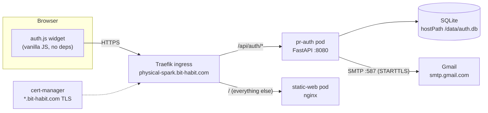
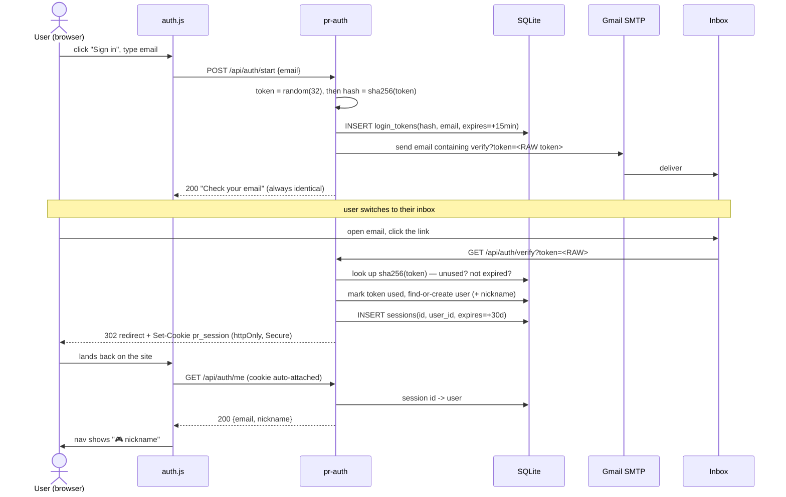

# How passwordless email login works (magic link)

> **Audience:** engineers (École 42 level — you know C, systems, HTTP; you may be new to web-auth specifics like
> cookies, SMTP, sessions). **Goal:** understand our login end-to-end well enough to explain it, extend it, or teach it.
> **The system:** the `pr-auth` service (`auth/` in this repo) behind the Physical Spark site.

---

## 1. The idea in one sentence

Instead of a password (**something you know**), we prove identity with **something you have** — access to your inbox.
You type your email, we email you a one-time link, you click it, you're in. **There is no password anywhere in the system.**

A nice side effect: **sign-up and log-in are the same flow.** The first time we see an email, we create the account
(and mint a random nickname like `brave-otter-42`); every time after, we just start a session. One code path, no
"register vs login" fork.

Two common flavors of this pattern:
- **Magic link** — the email contains a URL you click (what we use).
- **OTP code** — the email contains a 6-digit code you type back. (The bithabit habit app uses this variant.)

Same security model; the link is one fewer step for the user.

---

## 2. The big picture

Everything runs on our k3s cluster. The browser only ever talks to **one hostname**, and Traefik splits traffic by
path — static files vs. the auth API. That "same hostname" detail matters a lot for cookies (see §7).



- **`auth.js`** — a tiny widget injected into every page's nav. It calls the API and swaps "Sign in" ⇄ "🎮 nickname".
- **`pr-auth`** — a FastAPI service. Four endpoints, one SQLite file, one SMTP connection.
- **SMTP (Gmail)** — we reuse the habit app's existing Gmail app-password to actually send mail. No new provider.
- **SQLite on a hostPath** — a single file on the node. Fine for our scale; one writer (the deployment is `Recreate`,
  single replica).

---

## 3. The full flow, end to end



Notice the token exists in **two forms**: the **raw** token travels in the email/URL and is never stored; only its
**SHA-256 hash** lives in the DB. That asymmetry is the core security trick — more in §6.

---

## 4. Step by step, with the real code

All snippets are from `auth/app.py` (the service) and `site/auth.js` (the browser widget).

### 4a. Ask for a link — `POST /api/auth/start`

```python
@app.post("/api/auth/start")
def start(req: StartReq):                       # StartReq validates it's a real email (pydantic EmailStr)
    email = req.email.lower().strip()
    con = db()
    # rate limit: one link per 30s per email (stops inbox spamming)
    recent = con.execute(
        "SELECT created_at FROM login_tokens WHERE email=? ORDER BY created_at DESC LIMIT 1", (email,)
    ).fetchone()
    if recent and now() - recent[0] < RESEND_COOLDOWN:
        con.close()
        return {"ok": True, "message": "Check your email for a sign-in link."}

    token = _token()                            # secrets.token_urlsafe(32) — 256 bits of randomness
    th = hashlib.sha256(token.encode()).hexdigest()
    con.execute(
        "INSERT INTO login_tokens(token_hash,email,expires_at,used,created_at) VALUES(?,?,?,0,?)",
        (th, email, now() + TOKEN_TTL, now()),  # store the HASH, never the raw token
    )
    con.commit(); con.close()

    link = f"{SITE}/api/auth/verify?token={token}"   # the RAW token only ever lives here + in the email
    send_email(email, "Sign in to Physical Spark",
               f"Click to sign in (valid 15 minutes):\n\n{link}\n\n"
               f"If you didn't request this, you can ignore this email.")
    # Always the SAME response, whether or not the email exists — see §6 (no account enumeration).
    return {"ok": True, "message": "Check your email for a sign-in link."}
```

Three deliberate choices already: **hash the token before storing**, **short TTL**, and **identical response every
time**. Hold that thought for §6.

### 4b. Actually send the mail — SMTP

```python
def send_email(to_addr: str, subject: str, body: str):
    host = os.environ.get("SMTP_HOST")
    if not host:                                # no SMTP configured -> "dev mode"
        print(f"[DEV EMAIL] to={to_addr} :: {body}", flush=True)   # link goes to the pod log
        return
    msg = EmailMessage()
    msg["From"] = os.environ.get("SMTP_FROM", "no-reply@bit-habit.com")
    msg["To"] = to_addr
    msg["Subject"] = subject
    msg.set_content(body)
    port = int(os.environ.get("SMTP_PORT", "587"))
    with smtplib.SMTP(host, port, timeout=15) as s:
        s.starttls(context=ssl.create_default_context())   # upgrade the TCP connection to TLS
        user = os.environ.get("SMTP_USER")
        if user:
            s.login(user, os.environ.get("SMTP_PASS", ""))
        s.send_message(msg)
```

The credentials come from a **Kubernetes secret** (`pr-auth-email`) mounted as env vars — never hardcoded, never in
git. If the secret is absent, the service runs in **dev mode** and prints the link to the pod log instead of sending
— so the whole flow is testable with zero email setup (`kubectl logs deploy/pr-auth`).

> **SMTP in one line:** it's a plaintext-ish TCP protocol for handing an email to a mail server. `STARTTLS` upgrades
> the connection to TLS first; `login()` authenticates with a username + an **app password** (a scoped, revocable
> credential — not your real Gmail password).

### 4c. Click the link — `GET /api/auth/verify`

This is where sign-up-or-login happens, a session is created, and the cookie is set.

```python
@app.get("/api/auth/verify")
def verify(token: str):
    th = hashlib.sha256(token.encode()).hexdigest()          # hash the incoming raw token the same way
    con = db()
    row = con.execute("SELECT email, expires_at, used FROM login_tokens WHERE token_hash=?", (th,)).fetchone()
    if not row or row[2] or row[1] < now():                  # not found | already used | expired -> reject
        con.close()
        raise HTTPException(400, "This sign-in link is invalid or has expired.")
    email = row[0]
    con.execute("UPDATE login_tokens SET used=1 WHERE token_hash=?", (th,))   # single use: burn it now

    u = con.execute("SELECT id FROM users WHERE email=?", (email,)).fetchone()
    if u:
        uid = u[0]                                           # returning user
    else:                                                    # first time -> create account + nickname
        nick = generate_nickname(
            lambda n: con.execute("SELECT 1 FROM users WHERE nickname=?", (n,)).fetchone() is not None
        )
        uid = con.execute("INSERT INTO users(email,nickname,created_at) VALUES(?,?,?)",
                          (email, nick, now())).lastrowid

    sid = _token()                                           # opaque session id (another 256-bit random)
    con.execute("INSERT INTO sessions(id,user_id,expires_at) VALUES(?,?,?)", (sid, uid, now() + SESSION_TTL))
    con.commit(); con.close()

    resp = RedirectResponse(SITE + "/?welcome=1", status_code=302)
    resp.set_cookie("pr_session", sid, max_age=SESSION_TTL,
                    httponly=True, secure=True, samesite="lax",
                    domain=COOKIE_DOMAIN, path="/")           # the three flags that matter — see §6
    return resp
```

The nickname generator is pure **rejection sampling** — draw a random `adjective-noun-NN`, keep drawing until it's
free. Optimal when the namespace (~90k combos) dwarfs the taken set:

```python
def generate_nickname(exists):
    while True:
        name = f"{secrets.choice(ADJECTIVES)}-{secrets.choice(NOUNS)}-{secrets.randbelow(100):02d}"
        if not exists(name):
            return name
```

### 4d. Stay logged in — the cookie + `GET /api/auth/me`

After `verify`, the browser holds an `httpOnly` cookie `pr_session=<sid>`. The browser **automatically attaches it**
to every same-site request — the JS never touches it (it *can't*; `httpOnly` hides it from `document.cookie`). On
each page load, `auth.js` asks "who am I?":

```javascript
async function refresh() {
  var slot = document.getElementById("pr-auth-slot");
  if (!slot) return;
  try {
    var r = await fetch(API + "/me", { credentials: "include" });   // cookie rides along
    if (r.ok) {
      var u = await r.json();
      slot.innerHTML = '<span class="pr-nick">🎮 ' + u.nickname + '</span> <a id="pr-logout">logout</a>';
      document.getElementById("pr-logout").onclick = logout;
      return;
    }
  } catch (_) {}
  slot.innerHTML = '<a id="pr-signin">Sign in</a>';               // 401 or offline -> show Sign in
  document.getElementById("pr-signin").onclick = function (e) { e.preventDefault(); open(); };
}
```

Server side, `/me` turns the cookie back into a user by joining `sessions → users`:

```python
def current_user(request: Request):
    sid = request.cookies.get("pr_session")
    if not sid:
        return None
    con = db()
    row = con.execute(
        "SELECT u.email, u.nickname, s.expires_at FROM sessions s "
        "JOIN users u ON u.id = s.user_id WHERE s.id=?", (sid,)).fetchone()
    con.close()
    if not row or row[2] < now():      # unknown or expired session
        return None
    return {"email": row[0], "nickname": row[1]}
```

**Logout** just deletes the session row and clears the cookie — because sessions are server-side, logout is real
(the session id is dead even if someone copied the cookie).

---

## 5. The data model (3 tables)

```sql
CREATE TABLE users(
    id INTEGER PRIMARY KEY AUTOINCREMENT,
    email    TEXT UNIQUE NOT NULL,
    nickname TEXT UNIQUE NOT NULL,
    created_at INTEGER NOT NULL
);
CREATE TABLE login_tokens(          -- short-lived, single-use magic-link tokens
    token_hash TEXT PRIMARY KEY,    -- sha256(raw token) — NEVER the raw token
    email      TEXT NOT NULL,
    expires_at INTEGER NOT NULL,
    used       INTEGER NOT NULL DEFAULT 0,
    created_at INTEGER NOT NULL
);
CREATE TABLE sessions(              -- long-lived login sessions
    id         TEXT PRIMARY KEY,    -- the opaque value stored in the cookie
    user_id    INTEGER NOT NULL,
    expires_at INTEGER NOT NULL
);
```

`login_tokens` is "prove you own this email, once, soon." `sessions` is "you're logged in for 30 days." Keeping them
separate means a stolen/expired link can't become a session, and revoking a session doesn't touch login.

---

## 6. The security model — why each line exists

This is the part worth teaching. Each property defends against a specific attack:

| Property (in code) | Defends against | How |
|---|---|---|
| **Token stored as `sha256(token)`** | DB leak → replay | The DB never holds anything you can put in a URL. An attacker who dumps `login_tokens` gets hashes, which can't be turned back into working links. |
| **`used` flag, set on verify** | Link replay / shoulder-surf | A link works exactly **once**. Clicking again → 400. |
| **15-min TTL (`expires_at`)** | Old links in inbox history | A leaked email from last week is already dead. |
| **256-bit random token** (`secrets.token_urlsafe(32)`) | Guessing / brute force | The space is astronomically large; no rate of guessing matters. Uses `secrets`, not `random` (CSPRNG, not predictable PRNG). |
| **Identical `/start` response always** | Account **enumeration** | The API never reveals whether an email is registered — same 200 + same message either way. |
| **Per-email 30s cooldown** | Inbox flooding | Can't be used to spam someone with links. |
| **Cookie `httpOnly`** | XSS stealing the session | JavaScript (incl. injected XSS) cannot read `pr_session`. |
| **Cookie `Secure`** | Network sniffing | The cookie is only ever sent over HTTPS. |
| **Cookie `SameSite=Lax`** | CSRF | The cookie isn't sent on cross-site POSTs, so another site can't ride your session. |
| **Server-side sessions** | Un-revocable logout | Logout deletes the row; a copied cookie dies instantly. (Contrast: a stateless JWT is valid until it expires, even after "logout".) |

> **Sessions vs JWT — why we chose sessions.** A JWT is self-contained: the server can validate it without a DB
> lookup, but it also can't easily *revoke* it. A server-side session is one extra DB read per request, but logout,
> "sign out everywhere", and instant bans are trivial. For a product with real user accounts, revocability wins.

**Known MVP gaps** (documented on purpose, for the security review before real users): no CSRF token on logout,
only per-email (not per-IP) rate limiting, no email-deliverability hardening (SPF/DKIM for a custom domain), no
passkey. The cookie domain is `.bit-habit.com`, i.e. the session is shared across **all** `*.bit-habit.com`
subdomains — convenient, but it means every service under that domain is in the same trust boundary. Worth revisiting.

---

## 7. Why one hostname (same-origin) matters

The browser sends cookies based on **origin** (scheme + host + port). If the auth API lived on a *different* host
(say `auth.bit-habit.com`) than the page (`physical-spark.bit-habit.com`), then:
- the login cookie would be **cross-site**, forcing `SameSite=None` (weaker), and
- browser requests would trigger **CORS** preflights and credential rules.

We sidestep all of that by putting the API on the **same host, different path**. Traefik routes by path — the auth
pod and the static pod share a hostname but not a process:

```yaml
# auth/k8s/ingress.yaml — one host, split by path
spec:
  rules:
  - host: physical-spark.bit-habit.com
    http:
      paths:
      - path: /api/auth      # -> the FastAPI auth pod
        pathType: Prefix
        backend: { service: { name: pr-auth-svc, port: { number: 8080 } } }
      - path: /              # -> the static site (nginx)
        pathType: Prefix
        backend: { service: { name: physical-spark-svc, port: { number: 80 } } }
  tls:
  - hosts: [ physical-spark.bit-habit.com ]
    secretName: tls-secret   # the existing wildcard *.bit-habit.com cert
```

So `fetch('/api/auth/me')` from `auth.js` is a plain same-origin request: the cookie is first-party, no CORS, nothing
to weaken. **This is the single most important architectural decision in the whole feature.**

---

## 8. War stories (real bugs we hit — good teaching material)

- **`source .env` ate the password.** We reused the habit app's Gmail app password from its `.env`. Gmail shows app
  passwords with spaces (`abcd efgh ijkl mnop`); the value was unquoted, so `. ./.env` treated only `abcd` as the
  value and dropped the rest → the secret's `SMTP_PASS` came out **empty** → Gmail returned `535 BadCredentials`.
  Fix: extract the field explicitly and strip spaces — `grep '^GMAIL_APP_PASSWORD=' .env | cut -d= -f2- | tr -d "\"' "`.
  **Lesson:** never `source` a `.env` with values that contain spaces/special chars; parse the field.
- **We diagnosed it without ever printing the secret.** We checked the *length* of the stored value
  (`... | base64 -d | wc -c` → `0` vs the expected `16`). Length is a safe signal; the value never left the server.
- **"curl works but the browser doesn't."** After deploy, the UI showed an error while `curl` returned 200. Cause:
  a **stale cached page** loaded before `/api/auth` existed. **Lesson:** for "works in curl, fails in browser," the
  first suspects are cache and timing — hard-refresh, then reproduce the exact request in the browser console.

---

## 9. How to run/test it yourself

- **Dev mode (no email):** don't set `SMTP_HOST`. `POST /api/auth/start`, then read the magic link from the pod log:
  `kubectl logs deploy/pr-auth | grep 'DEV EMAIL'`. Paste the link → you're logged in. Full flow, zero email setup.
- **Reproduce in a real browser console** (this is exactly how we verified it live):
  ```javascript
  await fetch('/api/auth/start', { method:'POST', headers:{'Content-Type':'application/json'},
      credentials:'include', body: JSON.stringify({ email:'you@example.com' }) }).then(r => r.status)  // 200
  ```
- **Inspect state (no secrets):** `kubectl exec deploy/pr-auth -- python -c "import sqlite3;
  print(sqlite3.connect('/data/auth.db').execute('SELECT count(*) FROM users').fetchone())"`.

---

## 10. Where to take it next (phase-2)

- **Apple passkey (WebAuthn)** as a second, phishing-resistant method alongside the email link.
- **Per-IP rate limiting + CSRF token** on state-changing routes (the security-review list).
- **Server-side progress sync** — right now course progress lives in `localStorage`; once there's an account, move it
  server-side keyed by `user_id`.
- **Deliverability** — a proper `From` on the bit-habit.com domain with SPF/DKIM so mail stops landing in Junk.

---

## 관련 (Related)
- Code + deploy: [`auth/README.md`](../../auth/README.md), `auth/app.py`, `auth/nicknames.py`, `site/auth.js`, `auth/k8s/`.
- Decisions & boundaries: [[0002-handling-private-elements|ADR 0002 (public/private)]].
- Onboarding map: [ONBOARDING.md](../../ONBOARDING.md).
